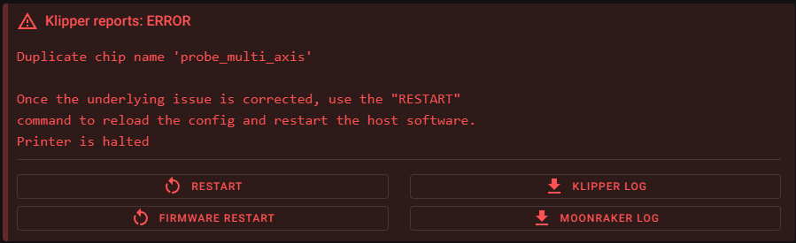

# Axiscope

## What is Axiscope?

Axiscope is a specialized tool designed to simplify the XY calibration process for multi-tool 3D printers using camera-assisted alignment. It provides a streamlined interface for:

- Manual XY calibration using camera feedback
- Quick and precise T0 - Tn alignment
- No calculation required, It just does its magic and tell you the offset.

<br/>
<br/>

## Hardware Requirements

### Camera Options

#### DIY Option
The following parts are required if you want to build the camera yourself:

- [\[XY Nozzle Alignment Camera\]](https://www.printables.com/model/1099576-xy-nozzle-alignment-camera) - 3D printed parts
- OV9726 camera module
- 5V 3mm round white6000-6500k LEDS x 4

#### Pre-assembled Option
A fully assembled camera with long USB cable can be purchased from:
- [Ember Prototypes](https://www.emberprototypes.com/products/cxc)

### Z Calibration Requirements (Optional)

If you want to use automatic Z calibration:
- An endstop switch mounted at a known position
- Configuration added to your printer.cfg (see Configuration section)


## Installation

**Requirements:**

- Klipper installed and running
- [Klipper Tool Changer](https://github.com/viesturz/klipper-toolchanger)
- Moonraker configured
- camera setup and running in crownest
- SSH access to your printer


Quick installation using curl:

```bash
curl -sSL https://raw.githubusercontent.com/nic335/Axiscope/refs/heads/main/install.sh | bash
```

The install script will:

- Create Python virtual environment
- Install required dependencies
- Set up the systemd service
- Configure Moonraker integration

### Starting Axiscope

1. Open your Mainsail interface
2. Find 'axiscope' in the services list under "Klipper/Service/Host Control"
3. Use the Start/Stop button to control the service

<br/>

## Configuration

If you want to use automatic Z calibration, add the following to your `printer.cfg`:

```ini
[axiscope]
pin: !PG15                # Endstop pin
zswitch_x_pos: 226.71     # REQUIRED - X position of the endstop switch
zswitch_y_pos: -18.46     # REQUIRED - Y position of the endstop switch
zswitch_z_pos: 7.8        # REQUIRED - Z position + some clearance of the endstop switch
lift_z: 1                 # OPTIONAL - Amount to lift Z before moving (default: 1)
move_speed: 60            # OPTIONAL - XY movement speed in mm/s (default: 60)
z_move_speed: 10          # OPTIONAL - Z movement speed in mm/s (default: 10)
start_gcode: M118 Starting calibration G28 -> QGL -> G28Z
             G28
             QUAD_GANTRY_LEVEL
             G28 Z
             #G0 X175 Y175 Z30 F3000   # Move to center @ focal length of camera Z=30
before_pickup_gcode: M118 Something Could be Done here
after_pickup_gcode: M118 NozzleScrub
                    M109 S150
                    #NOZZLE_SCRUBBER_MACRO
finish_gcode: M118 Calibration complete
              T0
```

### Finding the Endstop Position

To correctly configure the endstop position for Z calibration:

1. Home your printer with T0 selected
2. Using the jog controls in your printer interface, carefully position the nozzle directly centered over the endstop pin
3. Note the current X, Y, and Z positions displayed in your interface
4. Use these values for `zswitch_x_pos` and `zswitch_y_pos` in your configuration
5. For `zswitch_z_pos`, add 3mm to your current Z position (If using multiple hotends of varying lengths, add additional clearance as needed.)

Example: If your position readings are X:226.71, Y:-18.46, Z:4.8, then configure:
```
zswitch_x_pos: 226.71
zswitch_y_pos: -18.46
zswitch_z_pos: 7.8  # 4.8 + 3mm clearance
```

### G-code Macro Options

Axiscope now supports templated G-code macros with full Jinja template support.

- **start_gcode**: Executed at the beginning of calibration
- **before_pickup_gcode**: Executed before each tool change
- **after_pickup_gcode**: Executed after each tool change
- **finish_gcode**: Executed after calibration is complete


If you plan on using hostname to connect to your printer, For example voron.local:3000, you will need to add the following to your moonraker.conf: `*.local:*`
this should look like this

```ini
[authorization]
trusted_clients:
    192.168.0.0/16
    10.0.0.0/8
    127.0.0.0/8
    169.254.0.0/16
    172.16.0.0/12
    192.168.0.0/16
    FE80::/10
    ::1/128
cors_domains:
    *.lan
    *.local
    *.local:*
    *://localhost
    *://localhost:*
    *://my.mainsail.xyz
    *://app.fluidd.xyz
```


## Usage Guide

### Initial Setup

1. Access the web interface at `http://your-printer-ip:3000`
2. Select the printer address you are trying to calibrate, ( will most likely be autofiled soon )
3. Select the camera to use
   1. Align `T0` perfectly center to the crosair
   2. Capture Position
   3. Change to `Tn`
      1. Re-Align to center and press X and Y in the side navigator 
      2. From there your new calculated offset should be 

<br/>
<br/>
<br/>

## Troubleshooting FAQ

### Error: Duplicate chip name 'probe_multi_axis'

If you encounter this error when starting Klipper:

<br/>

**Problem:** You likely have both the toolchanger's `calibrate_offsets.cfg` and Axiscope configured in your printer.cfg. Both modules use the same 'probe_multi_axis' chip name.

**Solution:** 
1. Remove or comment out the inclusion of `calibrate_offsets.cfg` in your printer.cfg
2. OR ensure you're only using one of these two calibration methods, not both

Only Axiscope should be using the `probe_multi_axis` module when configured correctly.

## Credits
[Nic335](https://github.com/nic335) and [N3MI-DG](https://github.com/N3MI-DG)

## License
MIT License

Permission is hereby granted, free of charge, to any person obtaining a copy
of this software and associated documentation files (the "Software"), to deal
in the Software without restriction, including without limitation the rights
to use, copy, modify, merge, publish, distribute, sublicense, and/or sell
copies of the Software, and to permit persons to whom the Software is
furnished to do so, subject to the following conditions:

The above copyright notice and this permission notice shall be included in all
copies or substantial portions of the Software.

THE SOFTWARE IS PROVIDED "AS IS", WITHOUT WARRANTY OF ANY KIND, EXPRESS OR
IMPLIED, INCLUDING BUT NOT LIMITED TO THE WARRANTIES OF MERCHANTABILITY,
FITNESS FOR A PARTICULAR PURPOSE AND NONINFRINGEMENT. IN NO EVENT SHALL THE
AUTHORS OR COPYRIGHT HOLDERS BE LIABLE FOR ANY CLAIM, DAMAGES OR OTHER
LIABILITY, WHETHER IN AN ACTION OF CONTRACT, TORT OR OTHERWISE, ARISING FROM,
OUT OF OR IN CONNECTION WITH THE SOFTWARE OR THE USE OR OTHER DEALINGS IN THE
SOFTWARE.
