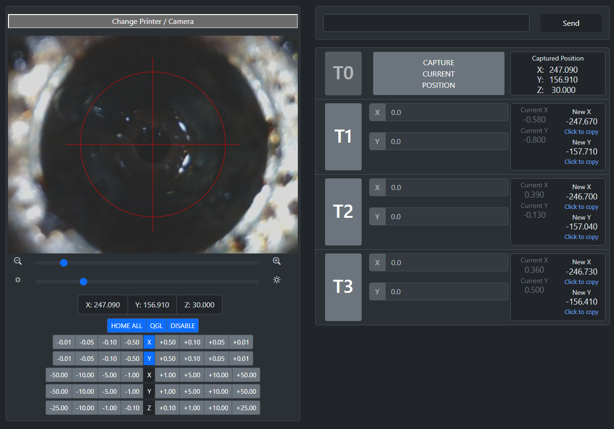
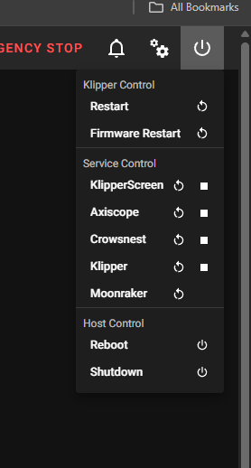
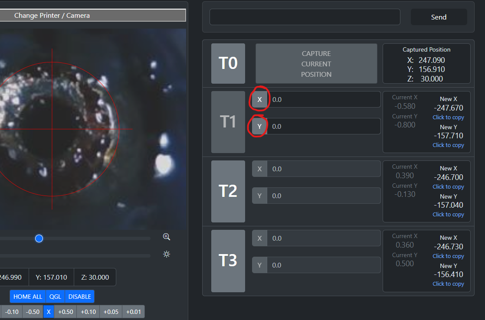
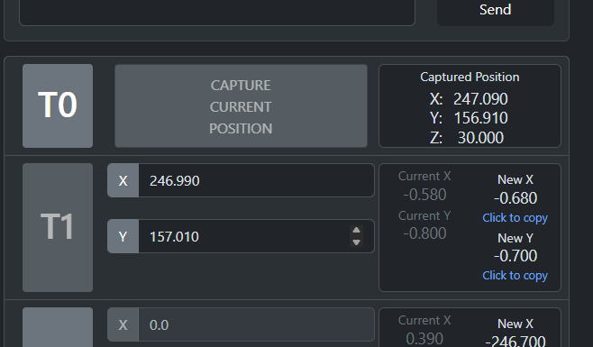

# AxisScope

## What is AxisScope?

AxisScope is a specialized tool designed to simplify the XY calibration process for multi-tool 3D printers using camera-assisted alignment. It provides a streamlined interface for:

- Manual XY calibration using camera feedback
- Quick and precise T0 - Tn alignment
- No calculation required, It just does its magic and tell you the offset.

<br/>
<br/>

## Hardware Requirements

### 3D Printed Parts

The following parts are required for camera mounting:

- [\[XY Nozzle Alignment Camera\]](https://www.printables.com/model/1099576-xy-nozzle-alignment-camera)
- OV9726 camera module


## Installation

**Requirements:**

- Klipper installed and running
- Moonraker configured
- SSH access to your printer


Quick installation using curl:

```bash
curl -sSL https://raw.githubusercontent.com/nic335/Axiscope/refs/heads/main/install.sh | bash
```

The install script will:

- Create Python virtual environment
- Install required dependencies
- Set up the systemd service
- Configure Moonraker integration

### Starting AxisScope

1. Open your Mainsail interface
2. Go to the Machine tab
3. Find 'axiscope' in the services list
4. Use the Start/Stop button to control the service

<br/>

## Usage Guide

### Initial Setup

1. Access the web interface at `http://your-printer-ip:3000`
2. Select the printer address you are trying to calibrate, ( will most likely be autofiled soon )
3. Select the camera to use
   1. Align `T0` perfectly center to the crosair
   2. Capture Position
   3. Change to `Tn`
      1. Re-Align to center and press X and Y in the side navigator 
      2. From there your new calculated offset should be 

<br/>
<br/>
<br/>

## Credits
[Nic335](https://github.com/nic335) and [N3MI-DG](https://github.com/N3MI-DG)

## License
MIT License

Permission is hereby granted, free of charge, to any person obtaining a copy
of this software and associated documentation files (the "Software"), to deal
in the Software without restriction, including without limitation the rights
to use, copy, modify, merge, publish, distribute, sublicense, and/or sell
copies of the Software, and to permit persons to whom the Software is
furnished to do so, subject to the following conditions:

The above copyright notice and this permission notice shall be included in all
copies or substantial portions of the Software.

THE SOFTWARE IS PROVIDED "AS IS", WITHOUT WARRANTY OF ANY KIND, EXPRESS OR
IMPLIED, INCLUDING BUT NOT LIMITED TO THE WARRANTIES OF MERCHANTABILITY,
FITNESS FOR A PARTICULAR PURPOSE AND NONINFRINGEMENT. IN NO EVENT SHALL THE
AUTHORS OR COPYRIGHT HOLDERS BE LIABLE FOR ANY CLAIM, DAMAGES OR OTHER
LIABILITY, WHETHER IN AN ACTION OF CONTRACT, TORT OR OTHERWISE, ARISING FROM,
OUT OF OR IN CONNECTION WITH THE SOFTWARE OR THE USE OR OTHER DEALINGS IN THE
SOFTWARE.
