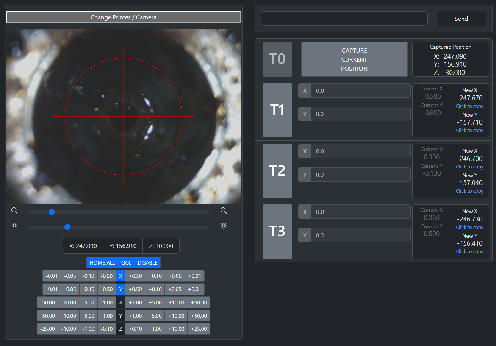
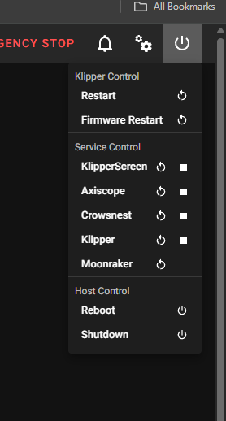
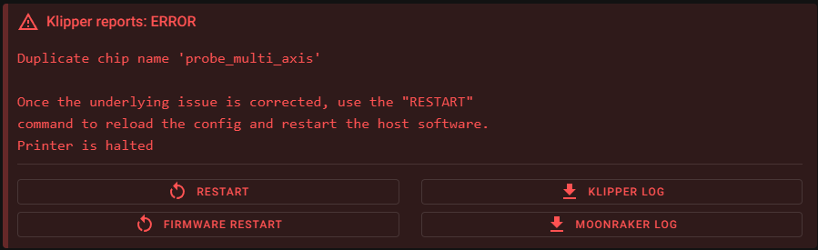

# Axiscope

Camera-assisted XY (and optional Z) tool alignment for multi-tool 3D printers running the [Klipper Tool Changer](https://github.com/viesturz/klipper-toolchanger) plugin. No manual math — align each tool over the crosshair and Axiscope calculates the offset for you.

<br/>
<br/>

## Table of Contents

- [Overview](#overview)
- [Hardware](#hardware)
- [Installation](#installation)
- [Configuration](#configuration)
  - [Basic Setup](#basic-setup)
  - [Finding the Endstop Position](#finding-the-endstop-position)
  - [Live Endstop Position Update](#live-endstop-position-update)
  - [LED Control](#led-control-ember-prototype-v2-camera)
  - [G-code Macro Options](#g-code-macro-options)
  - [Remote Access (Hostname/Moonraker)](#remote-access-hostnamemoonraker)
- [Usage Guide](#usage-guide)
- [Troubleshooting & FAQ](#troubleshooting--faq)
- [Credits](#credits)
- [License](#license)

## Overview

Axiscope provides:

- **Manual XY calibration** using live camera feedback
- **Quick T0 → Tn alignment**, tool by tool
- **Automatic offset calculation** — just align and capture, no math required
- **Optional automatic Z calibration** via a fixed or portable endstop switch
- **Optional camera LED control** (Ember Prototype CXC V2 camera)

## Hardware

### Camera

| Option | Details |
|---|---|
| **DIY** | [XY Nozzle Alignment Camera](https://www.printables.com/model/1099576-xy-nozzle-alignment-camera) (3D printed parts) + OV9726 camera module + 4x 5V 3mm round white (6000-6500K) LEDs |
| **Pre-assembled** | [Ember Prototypes CXC](https://www.emberprototypes.com/products/cxc) — long USB cable, ready to mount, portable z endstop |

> The CXC V2 camera from Ember Prototypes has an onboard PWM-controlled LED that Axiscope can drive directly from a spare MCU PWM pin. See [LED Control](#led-control-ember-prototype-v2-camera).

### Z Calibration (Optional)

To use automatic Z calibration you need:

- An endstop switch mounted at a known (or portable) position
- The corresponding config added to `printer.cfg` — see [Configuration](#configuration)

## Installation

**Prerequisites:**

- Klipper installed and running
- [Klipper Tool Changer](https://github.com/viesturz/klipper-toolchanger)
- Moonraker configured
- Camera set up in Crowsnest & Mainsail
- SSH access to your printer

**Install:**

```bash
curl -sSL https://raw.githubusercontent.com/nic335/Axiscope/refs/heads/main/install.sh | bash
```

This script will:

- Create a Python virtual environment
- Install required dependencies
- Set up the systemd service
- Configure Moonraker integration

**Start the service:**

1. Open Mainsail
2. Go to **Klipper → Service → Host Control** and find `axiscope`
3. Use the Start/Stop button

<br/>

## Configuration

### Basic Setup

Add an `[axiscope]` section to `printer.cfg`. Only `pin` and the three `zswitch_*_pos` values are required (and only if you want automatic Z calibration):

```ini
[axiscope]
pin: !PG15                # Endstop pin
zswitch_x_pos: 226.71     # REQUIRED - X position of the endstop switch
zswitch_y_pos: -18.46     # REQUIRED - Y position of the endstop switch
zswitch_z_pos: 7.8        # REQUIRED - Z position + clearance of the endstop switch

lift_z: 1                 # OPTIONAL - Z lift before XY moves (default: 1)
move_speed: 60            # OPTIONAL - XY move speed, mm/s (default: 60)
z_move_speed: 10          # OPTIONAL - Z move speed, mm/s (default: 10)

led_pwm_pin: PB3               # OPTIONAL - PWM pin driving the camera LED
led_pwm_cycle_time: 0.010      # OPTIONAL - PWM cycle time, s (default: 0.010)
led_pwm_initial_value: 0       # OPTIONAL - Initial LED brightness 0.0-1.0 (default: 0)

start_gcode:
  
  
      M104 T{tool} S150
  
before_pickup_gcode: M118 pickup_gcode
after_pickup_gcode: M118 after_pickup_gcode
finish_gcode: M118 Calibration complete
  
  
      M104 T{tool} S0
  
  T0
```

| Option | Required | Default | Description |
|---|---|---|---|
| `pin` | Yes* | — | Endstop pin used for Z calibration |
| `zswitch_x_pos` | Yes* | — | X position of the endstop switch |
| `zswitch_y_pos` | Yes* | — | Y position of the endstop switch |
| `zswitch_z_pos` | Yes* | — | Z position + clearance of the endstop switch |
| `lift_z` | No | `1` | Z lift (mm) before XY moves |
| `move_speed` | No | `60` | XY move speed (mm/s) |
| `z_move_speed` | No | `10` | Z move speed (mm/s) |
| `led_pwm_pin` | No | — | MCU PWM pin driving the camera LED |
| `led_pwm_cycle_time` | No | `0.010` | LED PWM cycle time (s) |
| `led_pwm_initial_value` | No | `0` | Initial LED brightness (`0.0`-`1.0`) |

*Only required if using automatic Z calibration.

### Finding the Endstop Position

1. Home the printer with `T0` selected
2. Jog the nozzle so it's centered directly over the endstop pin
3. Note the current X, Y, Z position from your interface
4. Use X and Y directly for `zswitch_x_pos` / `zswitch_y_pos`
5. Add ~3mm clearance to Z for `zswitch_z_pos` (more if hotends vary in length)

**Example:** readings of `X:226.71 Y:-18.46 Z:4.8` become:

```ini
zswitch_x_pos: 226.71
zswitch_y_pos: -18.46
zswitch_z_pos: 7.8  # 4.8 + 3mm clearance
```

### Live Endstop Position Update

If you use a portable endstop (e.g. the CXC V2 camera), you don't need to manually edit `zswitch_*_pos` and restart Klipper every time you reposition it — update it live instead:

1. Home the printer and jog the nozzle 1-2mm above the endstop switch
2. In the Axiscope UI, click **Set Endstop Position** in the positioning panel
3. Axiscope immediately updates its in-memory X/Y/Z endstop position to the toolhead's current position

Equivalent G-code:

```gcode
AXISCOPE_SET_ENDSTOP_POSITION CURRENT=1                  # X, Y, Z = current toolhead position
AXISCOPE_SET_ENDSTOP_POSITION X=150.0                    # Only X
AXISCOPE_SET_ENDSTOP_POSITION X=150.0 Y=200.0 CURRENT=1  # X, Y explicit; Z from current position
```

> **Note:** This updates the in-memory position for the current session only. To persist it across restarts, copy the reported values into `zswitch_x_pos`, `zswitch_y_pos`, and `zswitch_z_pos` in the `[axiscope]` section of `printer.cfg`.

### LED Control (Ember Prototype V2 Camera)

If your camera has an onboard LED (e.g. Ember Prototype V2 / CXC), Axiscope can drive it via PWM directly from the printer's MCU:

1. Wire the LED PWM input to a spare PWM-capable MCU pin
2. Set `led_pwm_pin` in `[axiscope]` (see [Basic Setup](#basic-setup))
3. Restart Klipper

Once configured, a brightness slider (light bulb icon) automatically appears in the Axiscope camera panel — drag it to set brightness 0-100%. It stays hidden if `led_pwm_pin` isn't set.

Control it directly from the console or a macro:

```gcode
AXISCOPE_SET_LED VALUE=0.5   # 0.0 (off) to 1.0 (full brightness)
```

### G-code Macro Options

Axiscope supports templated G-code macros with full Jinja support:

| Macro | Runs |
|---|---|
| `start_gcode` | At the start of calibration |
| `before_pickup_gcode` | Before each tool change |
| `after_pickup_gcode` | After each tool change |
| `finish_gcode` | After calibration completes |

### Remote Access (Hostname/Moonraker)

If you connect using a hostname (e.g. `voron.local:3000`), add `*.local:*` to `moonraker.conf`:

```ini
[authorization]
trusted_clients:
    192.168.0.0/16
    10.0.0.0/8
    127.0.0.0/8
    169.254.0.0/16
    172.16.0.0/12
    FE80::/10
    ::1/128
cors_domains:
    *.lan
    *.local
    *.local:*
    *://localhost
    *://localhost:*
    *://my.mainsail.xyz
    *://app.fluidd.xyz
```

## Usage Guide

1. Open `http://<your-printer-ip>:3000`
2. Select the printer to calibrate (autofill support coming soon)
3. Select the camera to use
4. Align `T0` perfectly to the crosshair, then **Capture Position**
5. Switch to `Tn`, re-align to center, then press **X** and **Y** in the side navigator to compute the offset

<br/>
<br/>
<br/>

## Troubleshooting & FAQ

### Camera doesn't show up in Axiscope

Make sure the camera is configured in both Crowsnest and Mainsail:

- [Configuring a camera in Crowsnest](https://mellow.klipper.cn/en/docs/DebugDoc/BasicTutorial/camera/)
- [Configuring the camera in Mainsail](https://docs.mainsail.xyz/settings/webcams)

### Camera only loads if plugged in before boot

Some cameras aren't auto-detected by Crowsnest if plugged in after boot. Restart the Crowsnest service instead of rebooting the whole printer.

### Error: `Duplicate chip name 'probe_multi_axis'`

<br/>

**Cause:** Both the toolchanger's `calibrate_offsets.cfg` and Axiscope are configured, and both use the `probe_multi_axis` chip name.

**Fix:**

1. Remove/comment out the `calibrate_offsets.cfg` include in `printer.cfg`, **or**
2. Only use one of the two calibration methods, not both

Only Axiscope should own the `probe_multi_axis` module.

## Credits

[Nic335](https://github.com/nic335) and [N3MI-DG](https://github.com/N3MI-DG)

## License

MIT License — see [LICENSE](LICENSE) or the full text below.

<details>
<summary>MIT License text</summary>

Permission is hereby granted, free of charge, to any person obtaining a copy
of this software and associated documentation files (the "Software"), to deal
in the Software without restriction, including without limitation the rights
to use, copy, modify, merge, publish, distribute, sublicense, and/or sell
copies of the Software, and to permit persons to whom the Software is
furnished to do so, subject to the following conditions:

The above copyright notice and this permission notice shall be included in all
copies or substantial portions of the Software.

THE SOFTWARE IS PROVIDED "AS IS", WITHOUT WARRANTY OF ANY KIND, EXPRESS OR
IMPLIED, INCLUDING BUT NOT LIMITED TO THE WARRANTIES OF MERCHANTABILITY,
FITNESS FOR A PARTICULAR PURPOSE AND NONINFRINGEMENT. IN NO EVENT SHALL THE
AUTHORS OR COPYRIGHT HOLDERS BE LIABLE FOR ANY CLAIM, DAMAGES OR OTHER
LIABILITY, WHETHER IN AN ACTION OF CONTRACT, TORT OR OTHERWISE, ARISING FROM,
OUT OF OR IN CONNECTION WITH THE SOFTWARE OR THE USE OR OTHER DEALINGS IN THE
SOFTWARE.

</details>
